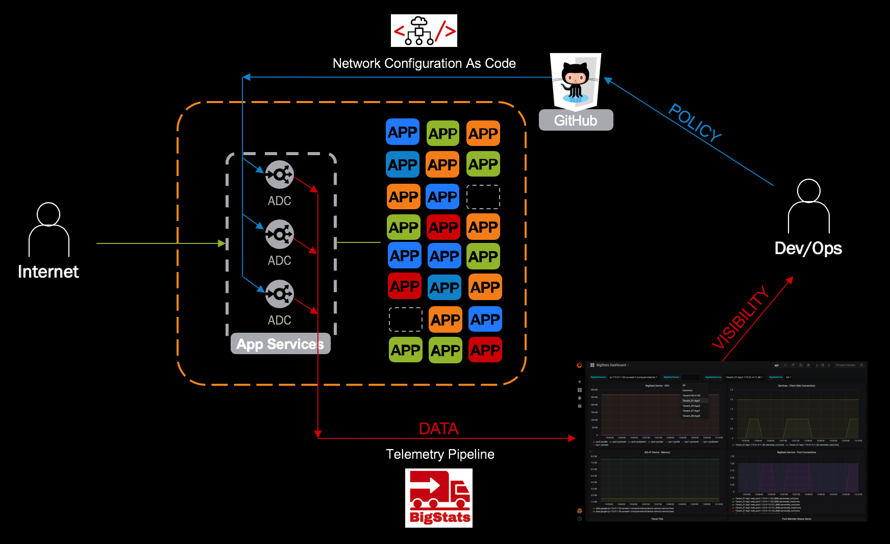

# Github Configuration-as-Code WebHook Server for F5 BIG-IP


Using GitHub's Webhook feature, this Webhook Server automates Configuration as Code management of F5's BIG-IP devices (hardware or software).

## Description

Configuration-as-Code has predominantely focussed on 'server' infrastructure. However, this 'Network Configuration as Code' solution allows engineers to 'commit' F5 BIG-IP service definitions to a Github, or Github Enterprise, repository, which results in configured F5 BIG-IP application services ready for application traffic. Installing this Webhook Server onto BIG-IP devices enables for the automated deployment of BIG-IP configurations directly via a Github Webhook.

This solution was written upon the iControl LX framework. Installed on a BIG-IP, this iControl LX worker presents a `/mgmt/shared/webhook/github-listener` REST end-point ready to receive Github 'commit' notifications.

Combine the Github Webhook Server with [BigStats](https://github.com/f5devcentral/BigStats) (telemetry exporter) for a more complete solution:



## Requirements

* Uses the AppSvcs_Integration v3.x (AS3) iControl LX worker to translate service definitions into BIG-IP configurations. Read more about this awesome API Surface here: http://clouddocs.f5.com/products/extensions/f5-appsvcs-extension/3/

> NOTE: AS3 is an F5 developed and supported iControl LX worker that greatly simplifies the programmable surface of BIG-IP.

### Concepts

* **iControl** - The F5 BIG-IP REST API.
* **iControl LX** - (iControl Language eXtension) The F5 BIG-IP REST API Framework, upon which you can create custom endpoints/workflows.
* **iControl LX worker/microservice** - Nodejs Javascript that is executed every time it's custom endpoint is hit with GET/POST/PUT/PATCH/DELETE.

## Workflow

1. Engineer is ready to deploy a service.
2. Engineer visits the devices "configuration as code" repository on GitHub and navigates to the '/templates' directory.
3. Based on their requirements, the engineer selects the appropriate template. e.g. "Basic load-balancing", "SSL Offload", "Web Application Firewall", and so on.
4. Engineer creates a new file in the '/deploy' directory using the template and enters the unique deployment-specific data, e.g.: service name, server IP addresses, etc. See template examples below.
5. The GitHub WebHook sends a Github 'commit' message to the iControl LX REST worker end-point at `/mgmt/shared/webhook/github-listener`.
6. The iControl LX worker consumes and processes as appropriate.
   1. The iContorl LX worker will parse the commit message and identify any service definition changes: if the commit has 'added', 'modified', or 'removed' a service definition.
   2. When complete, the iControl LX worker will create a 'Github Issue' in the source repository with the results (success/failure) of the commit processing.

## Repository Structure

```sh
GHE_IaC_WebHook
  |- README.md
  |- DIST
    |- GheWebhookServer-0.3.0-0005.noarch.rpm
  |- DOCS
    |- BIG-IP_SETUP.md
    |- GHE_SETUP.md
  |- EXAMPLES
    |- service_def_BAD.json
    |- service_def1.json
    |- service_def2.json
    |- service_def3.json
    |- service_def4.json
    |- service_def5.json
    |- service_def6.json
    |- service_def7.json
    |- service_def8.json
  |- SRC
    |- README.md
    |- GheWebhookServer
      |- nodesjs
        |- ghe_listener.js
        |- ghe_settings.js
        |- ghe_util.js
```

* `/DIST` - the RPMs to install onto BIG-IPs for IaC management.
* `/DOCS` - the setup and usage instructions for GHE an BIG-IP.
* `/EXAMPLES` - contains AS3 service definition examples for configuring BIG-IP application services.
* `/SRC` - the WebHook server iControl LX source.
